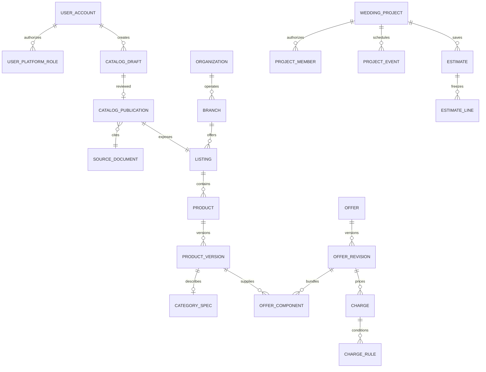

# All About Wedding — DB 구조와 실제 적용 범위

2026-09-28 · Java/Spring · React/TypeScript · PostgreSQL 16 서버

## 지금 DB는 이미 연결되어 있다

AWS의 `wedding` DB에 기존 V1/V2/V900~V903이 적용되어 있다. 회원, 관리자 권한, 찜, 업체 초안, CSV 업로드와 감사 이력은 PostgreSQL에 저장된다. 기본 로컬 `demo` 프로필은 메모리이며, DB 장애 시 demo로 대체하지 않는다. 기존 예식장 견적은 DB의 **가상 자료 4곳**을 조회하는 제한된 계산 기능이다.

이번 V904는 기존 데이터를 지우지 않고 3개 촬영 업종, 게시 연결 테이블, 촬영 사양 테이블을 추가한다. 관리자 초안과 공개 업체 기본 정보를 실제 DB를 통해 연결한다. 상품·가격 편집과 통합 견적 화면까지 완료한 것은 아니다.

## 관계와 책임

`CATEGORY_SPEC`는 설명용 이름이며 실제로는 `venue_spec`, `studio_spec`, `dress_spec`, `makeup_spec`, `jewelry_spec`, `hanbok_spec`, `suit_spec`, `capture_spec`로 나뉜다. 실제 FK와 제약은 Flyway SQL이 기준이다.

| 영역 | 테이블 | 업무 규칙 / 구현 현황 |
|---|---|---|
| 계정 | `iam.user_account`, `iam.local_credential`, `iam.user_platform_role` | 서버 계정 상태·역할로 관리자 권한 판단. 회원·관리자 인증 구현 |
| 업체 | `partner.organization`, `partner.branch` | 사업 주체와 실제 지점을 분리. 단순 이름 일치로 법인을 합치지 않음 |
| 공개 카탈로그 | `catalog.category`, `catalog.listing`, `catalog.listing_fact` | 업종별 검색 단위와 근거 사실. 검수된 기본 정보 공개 구현 |
| 상품 | `catalog.product`, `catalog.product_version`, 업종별 `*_spec` | 상품 ID는 유지하고 구성 변경은 새 버전. 테이블 존재, 편집 API/UI 후속 |
| 판매·가격 | `pricing.offer`, `offer_revision`, `offer_component`, `charge`, `charge_rule` | 실제 제공업체와 판매처·패키지 분리. 범용 가격 편집/계산 후속 |
| 고객 준비 | `planning.wedding_project`, `project_member`, `project_event`, `category_budget`, `shortlist` | 개인/공동 준비, 업종 예산, 행사 일정. 테이블 존재, 프로젝트 API/UI 후속 |
| 견적 | `pricing.estimate`, `estimate_line`, `planning.comparison` | 계산 조건·상품 버전·가격 근거·결과 스냅샷. 영구 견적 저장 API/UI 후속 |
| 일정 | `scheduling.service_resource`, `availability_observation` | 확인 시각과 유효기간을 가진 일정 관측. 예약 확정과 구분 |
| 후기·문의 | `engagement.inquiry`, `vendor_quote`, `experience`, `review` | 상담/실제 경험·검증·신고 분리. API/UI 후속 |
| 운영 | `ops.catalog_draft`, `catalog_import`, `catalog_publication`, `source_document`, `audit_event` | 초안·CSV·검수·공개·중단·귀속 이력 구현 |

## 이번에 연결한 관리자 업무

1. 관리자가 10개 업종 중 하나를 선택해 업체·지점 기본 정보 초안을 등록하거나 CSV를 검증/저장한다.
2. 초안은 공개 조회에서 보이지 않는다. 저장만으로 업체의 실제 가격이나 서비스가 만들어지지 않는다.
3. 공개 검수에서 출처 URL, 업체명, 주소, 연락처, 최근 90일 내 정보 확인일을 검토하고 명시적으로 확인한다.
4. 하나의 트랜잭션으로 운영 주체·지점·업종별 listing과 출처, 승인된 정보 스냅샷, 감사 이력을 저장한다. 실패하면 모두 취소한다.
5. `/directory`에는 공개 중이며 지점과 운영 주체가 활성 상태인 업체만 표시한다. 가상 예식장 견적 자료는 이 목록에 섞지 않는다.
6. 초안 수정은 공개 스냅샷을 바꾸지 않는다. 다시 게시할 때 새 출처 기록을 생성하고 기존 사실은 `SUPERSEDED`로 남긴다.
7. 게시 중단은 공개 목록에서 제외한다. 초안/과거 근거/감사 기록은 삭제하지 않는다. 초안 보관과 공개 중단은 별도 작업이다.

`catalog_publication.draft_version`은 승인한 초안의 버전, `version`은 공개/중단 작업 버전이다. 요청이 둘 중 하나라도 오래되면 409로 거절한다. draft 행 잠금으로 동시 게시/수정/중단을 직렬화한다. CSV commit은 기존 소유자 제한과 멱등 처리를 유지한다.

첫 게시 시 초안마다 **미검증 임시 운영 주체·지점**을 만든다. `legal_name`에는 입력 이름을 보관하되 법적 상호를 검증했다고 표시하지 않으며 `verification_status=UNVERIFIED`를 유지한다. 같은 업체의 다업종·다지점을 하나의 법인에 연결하는 관리자 병합/연결 화면은 후속이다. 임의의 이름 비교로 합치면 서로 다른 사업자 정보가 섞일 수 있기 때문이다. 공개 후 업종 변경도 막고 새 업종 초안을 사용한다.

## 업종별 세부 조건

아래는 모델에 넣을 조건의 설계 기준이며 모든 편집 화면이 구현됐다는 뜻은 아니다. `NULL`/`UNKNOWN`은 미확인이고 0원·미포함과 다르다. 서비스 포함 여부와 해당 서비스의 비용은 서로 다른 데이터다.

| 업종 | 사양 / 선택 조건 | 별도 비용으로 분리할 항목 |
|---|---|---|
| 예식장 | 홀, 수용 인원, 보증 인원, 식사 방식, 예식 간격, 실내외, 우천 대안, 주차 | 대관, 식대, 필수 장식, 음주류, 인원·날짜·시간 조건 |
| 스튜디오 | 촬영 시간, 의상 교체, 원본, 보정 컷, 앨범 페이지, 야외, 납기 | 원본 구매, 추가 보정, 액자, 야외 이동 |
| 드레스 | 본식/촬영 벌수, 라인·소재, 피팅 횟수, 대여 기간, 첫 착용 | 피팅, 라인 추가, 헬퍼, 출장, 오염/분실 조건 |
| 메이크업 | 신부·신랑·혼주 등 대상, 포함 인원, 헤어 포함, 직급, 출장, 시작 시간 | 혼주 인원, 이른 시작, 출장, 헤어 변형 |
| 예물 | 소재·순도·중량, 천연/랩그로운, 캐럿, 감정서, 사이즈 조정 | 세공, 추가 스톤, 사이즈 변경; 시세 적용 기준일 |
| 한복 | 신랑·신부·혼주, 벌수, 맞춤/대여, 기간, 장신구 | 추가 벌수, 맞춤 변경, 세탁/연체 |
| 예복 | 기성/MTM/비스포크, 원단, 피팅, 촬영 대여, 구성품 | 원단 등급, 추가 대여, 수선 |
| 본식스냅 | 촬영자/카메라 수, 준비~피로연 범위, 원본, 보정, 앨범, 납기 | 추가 촬영자, 시간 연장, 원본/앨범 추가 |
| 아이폰스냅 | 인원·시간·촬영 범위, 당일 프리뷰, 사진/짧은 영상 전달 | 시간 연장, 출장, 추가 촬영자 |
| DVD·본식영상 | FHD/4K/8K, 카메라 수, 원음, 하이라이트 길이, 풀영상, 납기 | 해상도 업그레이드, 추가 카메라, 연장, 출장 |

4K는 영상 해상도 조건이다. 사진 전용 본식스냅에 영상 해상도를 넣지 않도록 `capture_spec`의 DB 제약으로 막았다. 세부 사진 품질은 해상도·보정·파일 규격 같은 별도 정의가 필요하다. `capture_spec`는 이번에 테이블을 적용하지만 상품 편집/필터는 다음 단계다.

새 옵션은 모두 자유 JSON에 넣지 않는다. 검색/금액에 영향을 주는 공통 조건은 타입·단위·허용값을 정하고 정규 컬럼 또는 검증된 관계로 저장한다. 기존 `extension_attributes`는 계약된 버전의 비핵심 보조 속성에 한정한다. 서버에서 알 수 없는 옵션·범위를 거절하는 상품 편집 API를 먼저 구현한다.

## 업체 상세 구현 (V905)

사진 주소·권한·출처, 주차·교통, 정확한 날짜/한국 시간/인원별 참고 견적을 초안 → 검수 → 공개 흐름으로 연결했다. 상세 API는 `GET /api/v1/directory/{listingId}`, 화면은 `/directory/{listingId}`다. 조건이 다른 금액을 자동 계산하지 않으며, 실제 가격 규칙/조합 견적과 구별한다. 저장·검증·제약은 [listing-details.md](listing-details.md)를 참고한다.

## 가격과 마이페이지 견적의 다음 구현 단위

1. 상품/사양 편집 → 판매 조건 초안 → 금액·필수 여부·부가세·유효기간·출처 검수 → 가격 개정판 공개 순으로 연결한다. 업체 기본 정보 공개만으로 가격을 공개하지 않는다.
2. 예비부부는 `wedding_project`를 만들고 예식 날짜/시간/인원과 업종별 선택을 저장한다. 소유자/공동 사용자 권한을 서버에서 확인한다.
3. 계산은 서버가 공개된 상품/가격 버전을 다시 읽어서 수행한다. 브라우저가 보낸 총액은 신뢰하지 않는다.
4. 저장한 견적은 계산 조건·가격/상품 버전·출처·계산 엔진 버전을 고정한다. 이후 가격 변경으로 과거 견적을 덮어쓰지 않는다.
5. 한 업종 내 대안끼리는 비교하며 합산하지 않는다. 패키지와 개별 상품이 같은 서비스를 포함하면 중복을 표시한다. 각 업종에서 채택한 조합만 합산한다.
6. 미확인 필수 비용이 있으면 `PARTIAL`과 확인된 소계를 표시한다. 만료 견적은 재계산을 안내한다. 반환형 보증금은 예상 서비스 총액과 구분한다.

기존 `pricing.estimate`는 개별 offer 개정판 견적이다. 여러 업종을 하나로 저장하는 완성 견적 문서는 별도 `planning.quote`/`quote_item` 마이그레이션으로 구현할 예정이며, 이번 DB에 구현한 테이블처럼 취급하지 않는다.

## 보안과 운영

- `/api/v1/admin/**`는 DB의 현재 관리자 역할을 검사한다. 서버 서비스 메서드에도 관리자 제한을 둔다. 공개 등록으로 역할을 받을 수 없다.
- 게시/중단을 포함한 상태 변경에는 세션·CSRF가 필요하다. 공개 API는 내부 초안 ID, 관리 코드, 검수자 ID와 감사 데이터를 반환하지 않는다.
- 기본 출처는 인증정보 없는 http(s) URL만 허용하고 서버가 직접 접속하지 않는다. 상세 사진과 견적 출처는 HTTPS만 허용한다. 사진은 사용 권한을 확인한 외부 이미지 주소로 표시하며 서버가 원문/이미지를 복제하지 않는다.
- 목록은 20건, 페이지 0~5000, 검색어 최대 100자다. 대량 검색 시 인덱스/커서 페이지네이션을 별도로 개선한다.
- 마이그레이션용 계정만 DDL 가능하다. 실행 계정에는 기존처럼 DML만 부여하고 감사 이력의 UPDATE/DELETE를 금지한다.
- 배포 전 백업 후 Flyway를 실행한다. 애플리케이션 롤백이 SQL을 되돌리지는 않는다. 기존 적용 SQL을 수정하지 않는다.
- 실제 업체·가격·평점을 임의로 생성하지 않는다. 기능 검증 자료는 일회용 PostgreSQL CI DB에서 사용한다.

## API / 화면

| 경로 | 용도 |
|---|---|
| `GET /api/v1/directory?category=&query=&page=0` | 공개 업체 기본 정보 |
| `GET /api/v1/admin/publications?page=0` | 게시 및 중단 이력의 현재 상태 |
| `GET /api/v1/admin/catalog/{id}/publication` | 공개 검수 시 게시 버전 확인 |
| `POST /api/v1/admin/catalog/{id}/publish` | 초안/게시 버전, 확인일, 명시적 확인을 통한 공개 |
| `POST /api/v1/admin/catalog/{id}/withdraw` | 게시 버전 확인 후 공개 중단 |
| `/admin` | 업체 초안, 공개 검수, 검수·게시, CSV, 감사 이력 |
| `/directory` | 실제 검수 후 공개한 업체 목록 |
| `/` | 실제 공개 업체 기본 화면 |
| `/preview/venues` | 기존 가상 예식장 견적 체험 |
